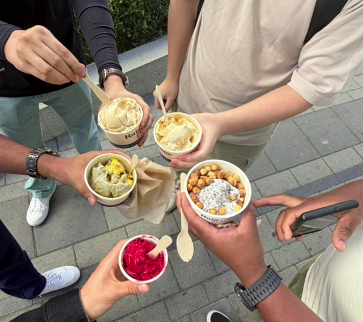

My mind raced as I boarded the bus to orientation. After years of studying exclusively online, I was about to sit in a physical classroom for the first time in a decade. Any lingering anxiety dissolved surprisingly fast. By the end of day one, an inspiring program introduction had left me energized, and I had already started connecting with classmates from around the globe with diverse professional backgrounds.

We spent that first evening wandering campus together, building early friendships over ice cream, an easy, unhurried evening that quietly set the tone for what was to come. Two weeks later, life has been a whirlwind of refreshing old skills, tackling new concepts, and readjusting to student life. I have settled into a rhythm: the evening before class, as soon as the lecture slides go live, I dive in to prep for the next day.

The school days themselves are a fast paced mix of lectures and hands on labs, and what has surprised me most is how vital that hands on time is. The labs bridge the gap between theory and practice, taking the concepts we discuss in class and making them genuinely click. It has been a big shift from studying behind a screen, but I am locked in and genuinely excited for what is ahead.

